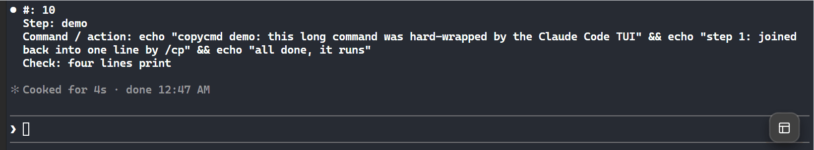

# copycmd

Copy text out of Claude Code without broken lines. Select, copy, type `/cp`, paste.



## The problem

Claude Code's terminal UI hard-wraps long lines at the terminal width and indents its
output by 2 spaces. Those are real newlines and spaces, so they end up in your clipboard.
What looks like one line on screen pastes as several:

```
  Command / action: echo "copycmd demo: this long command was hard-wrapped by the Claude Code TUI" && echo "step 1: joined
  back into one line by /cp" && echo "all done, it runs"
```

Pasting text like that elsewhere breaks things:

- **Shell / SSH**: the command runs in pieces: `command not found`,
  `syntax error near unexpected token '&&'`, or half a command running on a server
- **YAML, Python, config files**: the extra indent and line breaks cause parse errors
- **URLs and long tokens**: split in the middle, so the link no longer works
- **Chat, docs, issues, commit messages**: a paragraph turns into short broken lines

Fixing it by hand means deleting every line break and indent. `copycmd` does it for you:
it joins the wrapped lines, removes the indent and the `⏺` / `⎿` markers, and puts the
result back on the clipboard.

Two ways to run it, same logic:

- **`/copycmd`** (short: **`/cp`**): a Claude Code plugin (any OS); runs locally, starts no model turn
- **`copycmd`**: a standalone CLI (Windows, Python 3), for use outside Claude Code

## Claude Code plugin

```
/plugin install copycmd --marketplace YitFei/terminal-copy-unwrap
```

Answer `y` to add the marketplace, then pick a scope.

Use: copy the text in the terminal, type `/copycmd` (or the short form `/cp`), paste. In fullscreen mode you can
also just select the text and run `/copycmd`, with no copy step.

| Flag | Meaning |
|---|---|
| `-w N` | width the text was rendered at (use if joining is wrong) |
| `-1` | join everything into one line |
| `-p` | preview only, leave the clipboard alone |

The clipboard is read with PowerShell on Windows, `pbpaste` on macOS, and `wl-paste`,
`xclip` or `xsel` on Linux.

## How it unwraps
- removes `⏺` / `⎿` markers and the shared indent
- joins a line with the next when the next line's first word would not have fit
  (`width` = longest copied line, or the terminal width minus a small margin)
- keeps blank lines, list items, headings and shell `\` continuations
- a space-less line that fills the width (a cut URL) is joined without a space
- counts CJK characters as two columns

It is a heuristic: two short real lines are never joined, but a real line break right
after a near-full-width line can be. Use `-p` to check, `-w` to correct.

## Standalone CLI (Windows)
```powershell
powershell -ExecutionPolicy Bypass -File install.ps1   # adds copycmd to ~/.local/bin
```
Copy, run `copycmd` (inside Claude Code: `! copycmd`), paste. Same flags, `-p` = print only.

## Develop
```
python -m unittest discover -s tests     # CLI
claude plugin test plugin                # plugin
claude plugin validate .                 # marketplace + plugin
claude --plugin-dir plugin               # run the plugin from this folder
```

## License

MIT, see [LICENSE](LICENSE).
